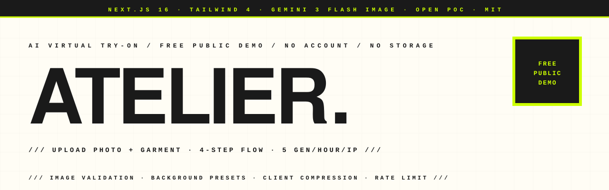

<p align="center">
  <picture>
    <source media="(prefers-color-scheme: dark)" srcset="assets-readme/hero-banner-dark.svg" />
    
  </picture>
</p>

<p align="center">
  <a href="https://virtual-tryon-poc-two.vercel.app"></a>
  <a href="https://github.com/hatimhtm/virtual-tryon-poc/actions/workflows/ci.yml"></a>
  
  
  
  <a href="LICENSE"></a>
</p>

<p align="center">
  <em>A free public AI virtual try-on demo. Upload a selfie, drop in a clothing photo, and Gemini 3 Flash Image composites the garment onto your body in ~30–45 seconds with realistic fit, fabric, and lighting. Two API routes, ~750 LOC, no database, no account, no photo storage. Built as a POC to validate the AI flow before going into a native app.</em>
</p>

---

### `/// THE FLOW`

```
       upload selfie  +  upload clothing photo  +  pick background
                                  │
                                  ▼
                  ┌──────────────────────────────┐
                  │ GEMINI 2.5 FLASH validates   │
                  │ the selfie  (single person,  │   ~3s
                  │  face visible, body framed)  │
                  └──────────────────────────────┘
                                  │
                                  ▼
                  ┌──────────────────────────────┐
                  │ GEMINI 3.1 FLASH IMAGE       │
                  │ composites the garment onto  │   ~30–45s
                  │ the body with the chosen     │
                  │ background + lighting        │
                  └──────────────────────────────┘
                                  │
                                  ▼
                       download · share · retry
```

---

### `/// FEATURES`

| | |
|---|---|
| **2-stage AI pipeline** | A cheap validation pass (Gemini 2.5 Flash) before the expensive image-gen call (Gemini 3.1 Flash Image). Cuts cost and bad-input failures. |
| **5 background presets** | Studio white · studio gray · urban · minimal beige · outdoor nature — each one rendered into the Gemini prompt as a lighting + composition cue. |
| **Multiple input methods** | File picker · drag-and-drop · paste from clipboard (⌘V) — the clipboard listener is global so it works at any step. |
| **Client-side compression** | All images are resized to max 1024px and re-encoded as JPEG quality 0.7 before upload, so we never hit Vercel's `413 Payload Too Large` limit. |
| **Rate limiting** | In-memory IP rate limiter — 5 generations / hour / IP, 20 validations / hour / IP. Echoes `X-RateLimit-*` and `Retry-After` headers. Imperfect (resets on cold start) but enough to deter drive-by abuse. |
| **No storage** | Images flow base64 → API → Gemini → base64 back. Nothing is persisted anywhere. The session ends when you close the tab. |
| **Brutalist UI** | Sharp corners, hard offset shadows, mono-font labels, acid-yellow accent. Cream-and-ink palette in light mode, ink-and-cream in dark mode. |
| **Health endpoint** | `GET /api/health` returns `200` if `GOOGLE_GENAI_API_KEY` is wired up. Doesn't burn quota on each call. |
| **Bilingual ready** | UI copy is French; technical docs are English. Easy to swap with one i18n library if you want. |

---

### `/// STACK`

```
NEXT.JS 16          App Router · server routes for API
TAILWIND 4          OKLCH-style tokens, light+dark via prefers-color-scheme
GEMINI 3.1 FLASH    image generation via @google/genai
GEMINI 2.5 FLASH    image validation (single-person + framing check)
FRAMER MOTION       step transitions
LUCIDE ICONS        the usual
ZERO DEPS BEYOND    Next, React, Tailwind, Framer Motion, Lucide,
                    @google/genai. No DB, no auth, no analytics.
```

---

### `/// LOCAL DEV`

```bash
git clone https://github.com/hatimhtm/virtual-tryon-poc.git
cd virtual-tryon-poc
cp .env.example .env.local        # fill in GOOGLE_GENAI_API_KEY
npm install
npm run dev                       # http://localhost:3000
npm run build                     # production bundle
npm run lint                      # ESLint
```

Requires **Node 20+** and a [Google AI Studio API key](https://aistudio.google.com/apikey) (free tier is plenty).

---

### `/// PROJECT LAYOUT`

```
virtual-tryon-poc/
├── src/
│   ├── app/
│   │   ├── page.tsx                  4-step flow — upload, upload, pick, result
│   │   ├── layout.tsx                fonts + metadata + OG/Twitter cards
│   │   ├── globals.css               brutalist tokens + scan animation
│   │   └── api/
│   │       ├── validate-image/       POST → Gemini 2.5 Flash (selfie check)
│   │       ├── generate-tryon/       POST → Gemini 3.1 Flash Image (try-on)
│   │       └── health/               GET  → liveness probe
│   └── lib/
│       └── rate-limit.ts             in-memory IP bucket + header helpers
├── public/                           static assets
├── .github/workflows/ci.yml          npm ci · lint · build on every push
├── assets-readme/                    brutalist hero banners (light + dark)
└── LICENSE                           MIT
```

---

### `/// V2 — THE OVERHAUL`

The 1.0 build shipped working but unpolished. v2 takes it from POC-on-a-Vercel-link to public-facing demo:

- **Brutalist UI** matching the rest of my portfolio — cream + ink + acid yellow, sharp corners, hard offset shadows, monospace labels, scan-bar loader.
- **Real metadata** in `layout.tsx` — title is no longer "Create Next App". OG cards, Twitter cards, inline SVG favicon, theme-color meta.
- **IP rate limiting** on both API routes (5 gen/hour, 20 validations/hour) with `X-RateLimit-*` headers so a friendly client can react gracefully.
- **`/api/health`** liveness probe.
- **`.env.example`** + negated `.gitignore` so the example actually ships.
- **CI workflow** runs `lint + build` on every push.
- **LICENSE** — MIT, because this is a POC people should be free to fork and learn from.
- **README** rewritten from the `create-next-app` boilerplate into something readable.

---

### `/// PRIVACY`

This demo doesn't store, log, or transmit your photos to anywhere except Google's Gemini API, and only for the duration of the single request. There is no database, no analytics SDK, no telemetry. Your images live in browser memory and Vercel function memory for the time it takes to generate the result, and that's it.

Gemini's own privacy terms apply for what they do with the request payloads — read [their docs](https://ai.google.dev/gemini-api/terms) for specifics.

---

### `/// LICENSE`

[MIT](LICENSE) — fork it, learn from it, rebuild it. Just keep the copyright line.

---

<p align="center">
  <a href="https://hatimelhassak.is-a.dev"></a>
  <a href="https://cal.com/hatimelhassak/engineering-discovery"></a>
  <a href="https://www.linkedin.com/in/hatim-elhassak/"></a>
  <a href="mailto:hatimelhassak.official@gmail.com"></a>
</p>

<p align="center">
  <code>///&nbsp;&nbsp;OPEN FOR NEW WORK&nbsp;&nbsp;///&nbsp;&nbsp;CONTRACT &amp; FREELANCE&nbsp;&nbsp;///&nbsp;&nbsp;REMOTE WORLDWIDE&nbsp;&nbsp;///</code>
</p>
